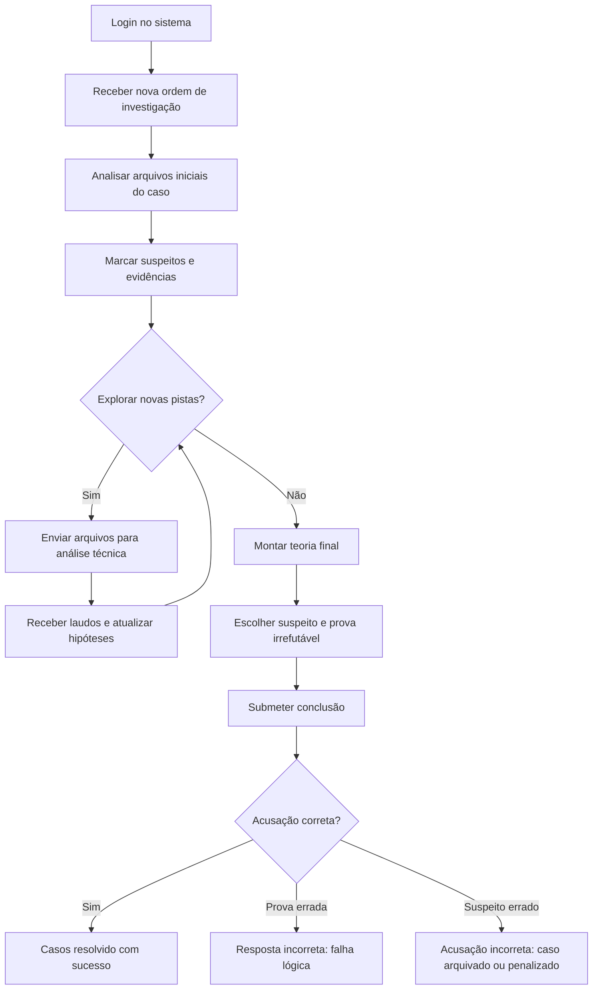

🔄 Fluxo do Jogador, Wireframe Funcional e Mecânicas de Falha/Sucesso

---

## 🎯 Objetivo do Documento

Este documento complementa o GDD principal com foco em três áreas:
	1.	Fluxo lógico da experiência do jogador
	2.	Protótipo funcional de interface (wireframe textual)
	3.	Regras de sucesso e falha durante a investigação

---

## 1. 🔁 Fluxo do Jogador (Etapas Lógicas da Investigação)



---

## 2. 💻 Protótipo Funcional de Interface (Wireframe Textual)

Este wireframe descreve a estrutura dos elementos que o jogador verá e manipulará, sem se preocupar ainda com aparência gráfica.

### 🖥️ Tela Principal (Simulação de Desktop Investigativo)

```text
+-------------------------------------------------------------+
| [Barra Superior: Relógio | Nome do Caso | Sair]            |
+-------------------------------------------------------------+
| [Ícones de Ferramentas:                                     |
|  📁 Arquivos   🎥 Mídia   🧪 Análise   🗺️ Mapa   📝 Notas ]     |
+-------------------------------------------------------------+
|                                                             |
|   [Área de Trabalho com Janelas Flutuantes]                 |
|                                                             |
|   Ex:                                                      |
|   - Janela "Relatório Policial 1" aberta                    |
|   - Janela "Vídeo Câmera 04" minimizada                    |
|   - Janela "Resultado da Análise Química" aberta           |
|                                                             |
+-------------------------------------------------------------+
```

### 🧪 Exemplo de Janela: Análise Forense

```text
+---------------------------------------------+
| 🧪 Análise de Evidência: Copo com resíduo     |
+---------------------------------------------+
| [Opções de Análise]:                         |
|   ( ) Impressão Digital                      |
|   ( ) DNA                                    |
|   (x) Química                                |
+---------------------------------------------+
| [Enviar para Análise] [Cancelar]             |
+---------------------------------------------+
```

### 📂 Exemplo de Navegação de Arquivos

```text
+-----------------------------+
| Pasta: /Casos/001/Dados     |
+-----------------------------+
| - relatório_sgt_freitas.pdf |
| - audio_testemunha.mp3      |
| - imagem_local.jpg          |
| - amostra_residuo.obj       |
+-----------------------------+
```

### 📝 Exemplo de Submissão Final

```text
+--------------------------------------------+
| Submissão Final do Caso                    |
+--------------------------------------------+
| Suspeito: [dropdown com nomes]             |
| Prova: [dropdown com arquivos marcados]    |
|                                            |
| [ENVIAR CONCLUSÃO]                         |
+--------------------------------------------+
```

---

## 3. ⚖️ Mecânicas de Falha e Sucesso

✅ Sucesso
	•	Suspeito correto e prova irrefutável correta
	•	Caso é considerado resolvido
	•	Jogador recebe avaliação positiva, elogio ou promoção simbólica

❌ Falha Parcial
	•	Suspeito correto, mas prova errada
	•	Sistema rejeita a conclusão
	•	Jogador pode tentar novamente

❌ Falha Total
	•	Suspeito errado
	•	Caso é arquivado ou jogador recebe advertência fictícia
	•	Algumas tentativas erradas podem bloquear reenvio (em casos difíceis)

🤔 Caso Inconclusivo
	•	Jogador decide arquivar o caso por falta de provas
	•	Sistema aceita mas indica que a verdade ficou sem solução

🌀 Consequências Narrativas (opcional)
	•	Sistema pode dar dicas futuras baseadas nos erros passados
	•	Casos futuros podem mencionar falhas anteriores (imersão narrativa)

---